<h1 align="center">
  <br>
  <a href="https://github.com/BrunoCiccarino/nekonight">
    
  </a>
  <br>
  🏙 Nekonight
  <br>
</h1>

<p align="center">
  <a href="https://github.com/BrunoCiccarino/nekonight">
    
  </a>
    <a href="https://github.com/BrunoCiccarino/nekonight">
    
  </a>  
  <a href="https://github.com/BrunoCiccarino/nekonight">
    
  </a>  
  <a href="https://github.com/BrunoCiccarino/nekonight">
    
  </a>  
  <a href="https://github.com/BrunoCiccarino/nekonight">
    
  </a>  

</p>

Looking for a theme that fits your vibe? Whether you're into dark mode, light mode, or something in between, this **NekoNight** has got you covered. Written in [Lua](https://www.lua.org) for snappy performance, it's a buffet of color schemes for every taste and mood. 🍭 Want to boost your productivity *and* look good while coding? We've got countless options to keep you inspired and in the zone. 🚀✨ If you love it (and we know you will), hit that ⭐ on our [official repo](https://github.com/BrunoCiccarino/nekonight). Your support means the world! 🌍

> [!NOTE]
> This theme is a fork of folke/tokyonight.nvim all rights reserved


## 🍭 Themes preview 
 
### 🎨 neovim

<table width="100%">
  <tr>
    <th>Moon</th>
    <th>Storm</th>
  </tr>
  <tr>
    <td width="50%">
      
    </td>
    <td width="50%">
      
    </td>
  </tr>
  <tr>
    <th>Night</th>
    <th>Day</th>
  </tr>
  <tr>
    <td width="50%">
      
    </td>
    <td width="50%">
      
    </td>
  </tr>
  <tr>
    <th>Mars</th>
    <th>Nord</th>
  </tr>
  <tr>
    <td width="50%">
      
    </td>
    <td width="50%">
      
    </td>
  </tr>
  <tr>
    <th>Shades of purple</th>
    <th>Shades of purple dark</th>
  </tr>
  <tr>
    <td width="50%">
      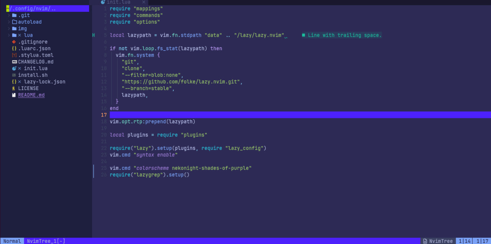
    </td>
    <td width="50%">
      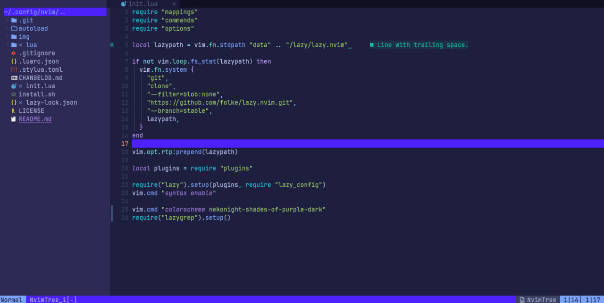
    </td>
  </tr>
   <tr>
    <th>OneDark</th>
    <th>Fire Obsidian</th>
  </tr>
  <tr>
    <td width="50%">
      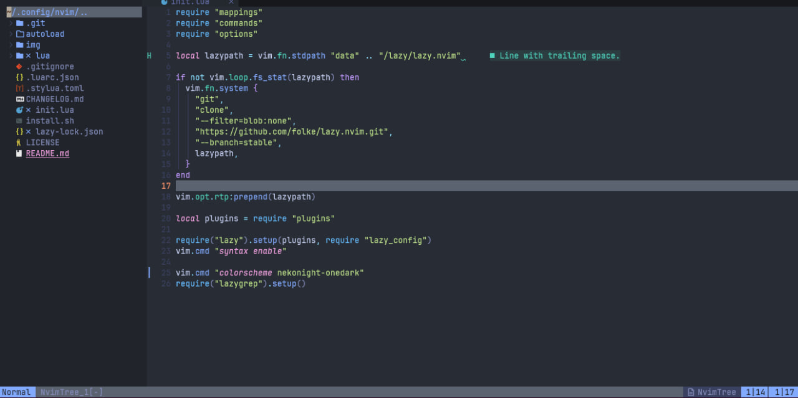
    </td>
    <td width="50%">
      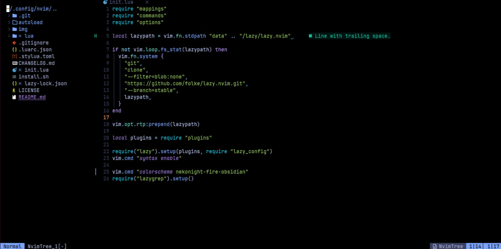
    </td>
  </tr>
  <tr>
    <th>Palenight</th>
    <th>Noctis-Uva</th>
  </tr>
  <tr>
    <td width="50%">
      
    </td>
    <td width="50%">
      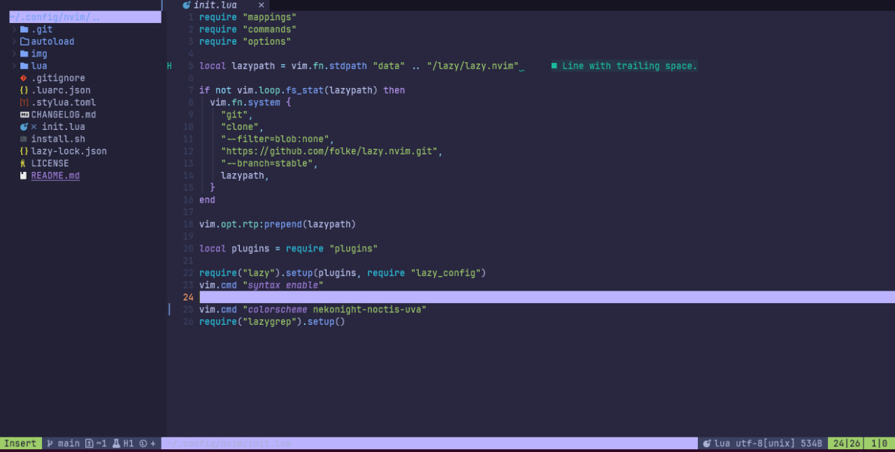
    </td>
  </tr>
    <tr>
    <th>Gruvbox</th>
    <th>Dracula</th>
  </tr>
  <tr>
    <td width="50%">
      
    </td>
     <td width="50%">
      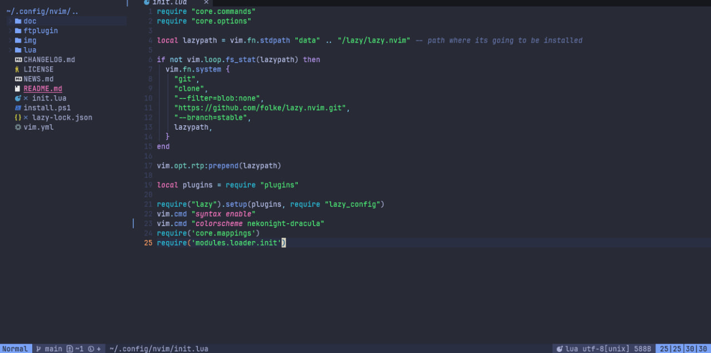
    </td>
  </tr>
    <tr>
    <th>Doom One</th>
    <th>Zenburn</th>
  </tr>
  <tr>
    <td width="50%">
      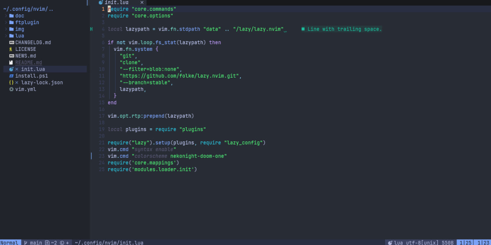
    </td>
     <td width="50%">
      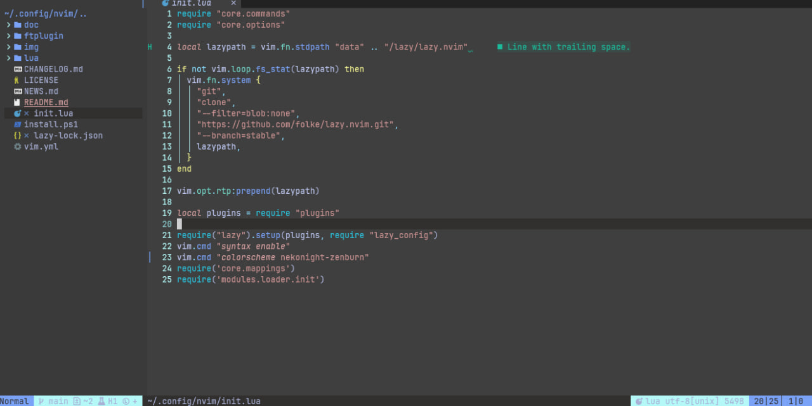
    </td>
  </tr>
      <tr>
    <th>Material theme</th>
    <th>Arcdark</th>
  </tr>
  <tr>
    <td width="50%">
      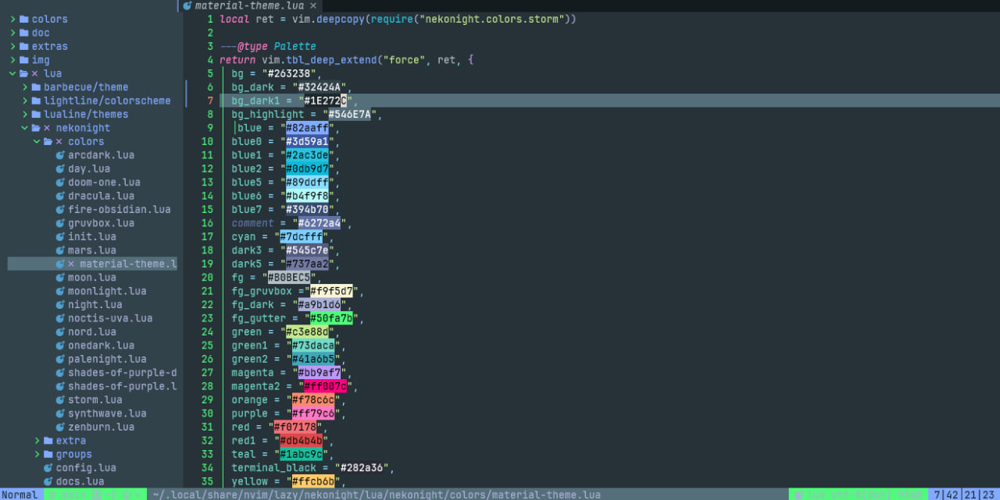
    </td>
     <td width="50%">
      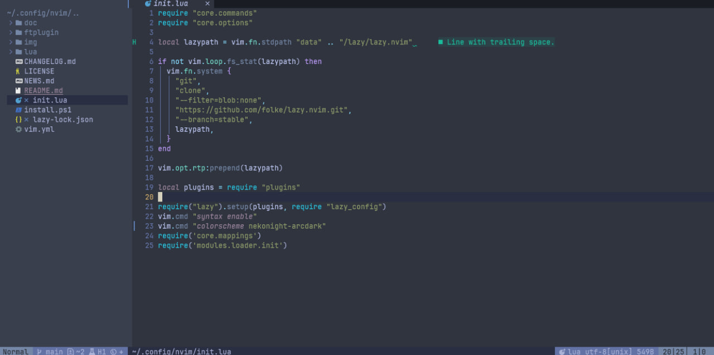
    </td>
  </tr>
  <tr>
    <th>Moonlight</th>
    <th>Synthwave</th>
  </tr>
  <tr>
    <td width="50%">
      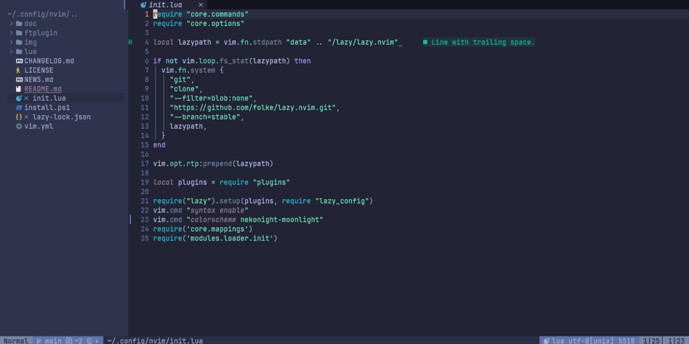
    </td>
     <td width="50%">
      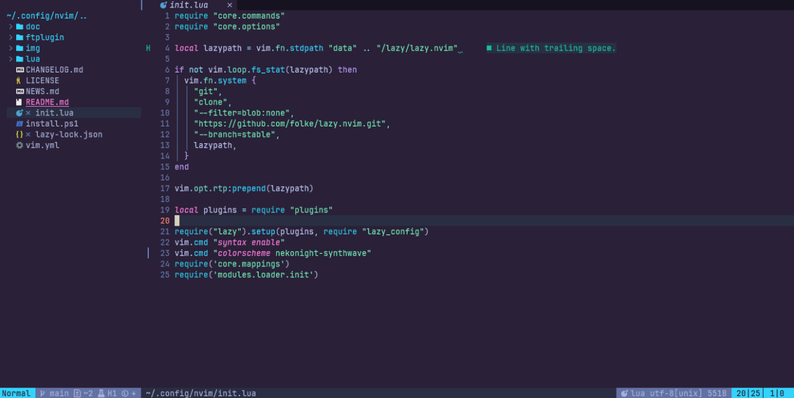
    </td>
  </tr>
    <tr>
    <th>Space</th>
    <th>Aurora</th>
  </tr>
  <tr>
    <td width="50%">
      
    </td>
    <td width="50%">
      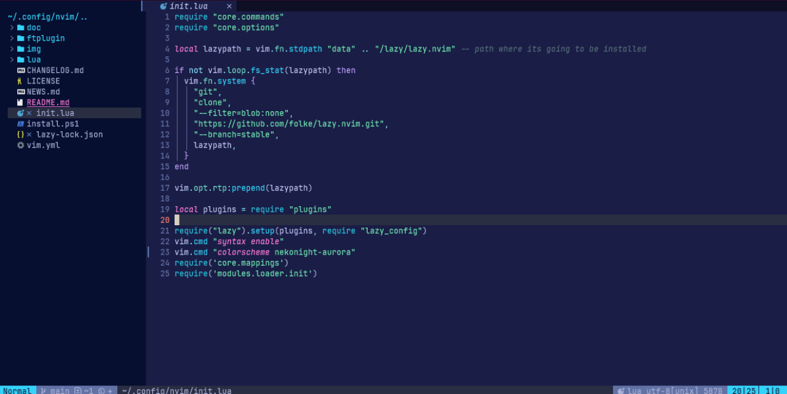
    </td>
  </tr>
    <tr>
    <th>OneDark Deep</th>
  </tr>
  <tr>
    <td width="50%">
      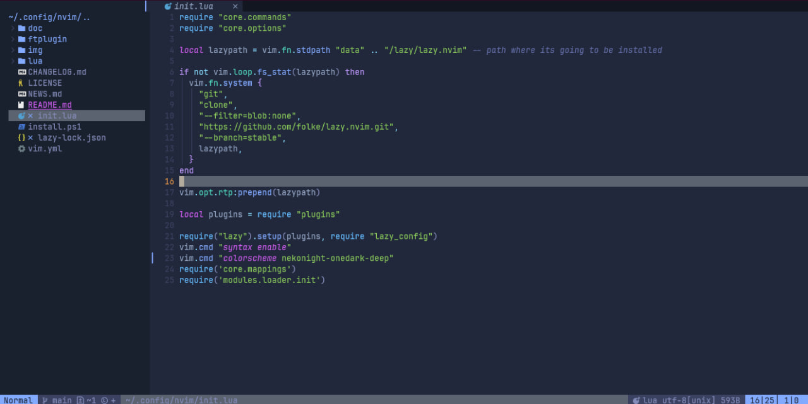
    </td>
  </tr>


  </table>

## ✨ Features

- Supports the latest [Neovim](https://github.com/neovim/neovim)
  [0.9.0](https://github.com/neovim/neovim/releases/tag/v0.9.0) features.
- Terminal colors.
- Supports all major plugins.
- Provides [NekoNight](https://github.com/BrunoCiccarino/nekonight)
  [extras](#-extras) for numerous other applications.

<details>
<summary>🎨 nekonight-storm palette</summary>

| Palette              | Hex     | RGB         | HSL           |
|----------------------|---------|-------------|---------------|
| Background           | #24283b | 36 40 59    | 225° 25% 19%  |
| Background Dark      | #1f2335 | 31 35 53    | 228° 25% 17%  |
| Background Dark1     | #1b1e2d | 27 30 45    | 229° 25% 14%  |
| Background Highlight | #292e42 | 41 46 66    | 230° 23% 21%  |
| Blue                 | #7aa2f7 | 122 162 247 | 223° 89% 73%  |
| Blue0                | #3d59a1 | 61 89 161   | 224° 45% 44%  |
| Blue1                | #2ac3de | 42 195 222  | 189° 78% 52%  |
| Blue2                | #0db9d7 | 13 185 215  | 191° 88% 45%  |
| Blue5                | #89ddff | 137 221 255 | 197° 100% 77% |
| Blue6                | #b4f9f8 | 180 249 248 | 179° 88% 84%  |
| Blue7                | #394b70 | 57 75 112   | 220° 33% 33%  |
| Comment              | #565f89 | 86 95 137   | 227° 22% 44%  |
| Cyan                 | #7dcfff | 125 207 255 | 202° 100% 75% |
| Dark3                | #545c7e | 84 92 126   | 227° 20% 41%  |
| Dark5                | #737aa2 | 115 122 162 | 227° 20% 54%  |
| Foreground           | #c0caf5 | 192 202 245 | 226° 68% 86%  |
| Foreground Gruvbox   | #f9f5d7 | 249 245 215 | 53° 75% 91%   |
| Foreground Dark      | #a9b1d6 | 169 177 214 | 225° 39% 75%  |
| Foreground Gutter    | #3b4261 | 59 66 97    | 227° 24% 31%  |
| Green                | #9ece6a | 158 206 106 | 91° 51% 61%   |
| Green1               | #73daca | 115 218 202 | 173° 58% 65%  |
| Green2               | #41a6b5 | 65 166 181  | 189° 47% 48%  |
| Magenta              | #bb9af7 | 187 154 247 | 261° 85% 79%  |
| Magenta2             | #ff007c | 255 0 124   | 330° 100% 50% |
| Orange               | #ff9e64 | 255 158 100 | 22° 100% 70%  |
| Purple               | #9d7cd8 | 157 124 216 | 262° 56% 67%  |
| Red                  | #f7768e | 247 118 142 | 351° 87% 72%  |
| Red1                 | #db4b4b | 219 75 75   | 0° 65% 58%    |
| Teal                 | #1abc9c | 26 188 156  | 168° 75% 42%  |
| Terminal Black       | #414868 | 65 72 104   | 227° 23% 33%  |
| Yellow               | #e0af68 | 224 175 104 | 34° 69% 64%   |

</details>

<details>
<summary>🎨 Supported Plugins</summary>

<!-- plugins:start -->

| Plugin | Source |
| --- | --- |
| [aerial.nvim](https://github.com/stevearc/aerial.nvim) | [`aerial`](lua/nekonight/groups/aerial.lua) |
| [ale](https://github.com/dense-analysis/ale) | [`ale`](lua/nekonight/groups/ale.lua) |
| [alpha-nvim](https://github.com/goolord/alpha-nvim) | [`alpha`](lua/nekonight/groups/alpha.lua) |
| [barbar.nvim](https://github.com/romgrk/barbar.nvim) | [`barbar`](lua/nekonight/groups/barbar.lua) |
| [blink.cmp](https://github.com/Saghen/blink.cmp) | [`blink`](lua/nekonight/groups/blink.lua) |
| [bufferline.nvim](https://github.com/akinsho/bufferline.nvim) | [`bufferline`](lua/nekonight/groups/bufferline.lua) |
| [nvim-cmp](https://github.com/hrsh7th/nvim-cmp) | [`cmp`](lua/nekonight/groups/cmp.lua) |
| [codeium.nvim](https://github.com/Exafunction/codeium.nvim) | [`codeium`](lua/nekonight/groups/codeium.lua) |
| [copilot.lua](https://github.com/zbirenbaum/copilot.lua) | [`copilot`](lua/nekonight/groups/copilot.lua) |
| [nvim-dap](https://github.com/mfussenegger/nvim-dap) | [`dap`](lua/nekonight/groups/dap.lua) |
| [dashboard-nvim](https://github.com/nvimdev/dashboard-nvim) | [`dashboard`](lua/nekonight/groups/dashboard.lua) |
| [flash.nvim](https://github.com/folke/flash.nvim) | [`flash`](lua/nekonight/groups/flash.lua) |
| [fugit2](https://github.com/SuperBo/fugit2.nvim) | [`fugit2`](lua/nekonight/groups/fugit2.lua) |
| [fzf-lua](https://github.com/ibhagwan/fzf-lua) | [`fzf`](lua/nekonight/groups/fzf.lua) |
| [vim-gitgutter](https://github.com/airblade/vim-gitgutter) | [`gitgutter`](lua/nekonight/groups/gitgutter.lua) |
| [gitsigns.nvim](https://github.com/lewis6991/gitsigns.nvim) | [`gitsigns`](lua/nekonight/groups/gitsigns.lua) |
| [glyph-palette.vim](https://github.com/lambdalisue/glyph-palette.vim) | [`glyph-palette`](lua/nekonight/groups/glyph-palette.lua) |
| [grug-far.nvim](https://github.com/MagicDuck/grug-far.nvim) | [`grug-far`](lua/nekonight/groups/grug-far.lua) |
| [headlines.nvim](https://github.com/lukas-reineke/headlines.nvim) | [`headlines`](lua/nekonight/groups/headlines.lua) |
| [hop.nvim](https://github.com/phaazon/hop.nvim) | [`hop`](lua/nekonight/groups/hop.lua) |
| [vim-illuminate](https://github.com/RRethy/vim-illuminate) | [`illuminate`](lua/nekonight/groups/illuminate.lua) |
| [indent-blankline.nvim](https://github.com/lukas-reineke/indent-blankline.nvim) | [`indent-blankline`](lua/nekonight/groups/indent-blankline.lua) |
| [indentmini.nvim](https://github.com/nvimdev/indentmini.nvim) | [`indentmini`](lua/nekonight/groups/indentmini.lua) |
| [lazy.nvim](https://github.com/folke/lazy.nvim) | [`lazy`](lua/nekonight/groups/lazy.lua) |
| [leap.nvim](https://github.com/ggandor/leap.nvim) | [`leap`](lua/nekonight/groups/leap.lua) |
| [lspsaga.nvim](https://github.com/glepnir/lspsaga.nvim) | [`lspsaga`](lua/nekonight/groups/lspsaga.lua) |
| [mini.animate](https://github.com/echasnovski/mini.animate) | [`mini_animate`](lua/nekonight/groups/mini_animate.lua) |
| [mini.clue](https://github.com/echasnovski/mini.clue) | [`mini_clue`](lua/nekonight/groups/mini_clue.lua) |
| [mini.completion](https://github.com/echasnovski/mini.completion) | [`mini_completion`](lua/nekonight/groups/mini_completion.lua) |
| [mini.cursorword](https://github.com/echasnovski/mini.cursorword) | [`mini_cursorword`](lua/nekonight/groups/mini_cursorword.lua) |
| [mini.deps](https://github.com/echasnovski/mini.deps) | [`mini_deps`](lua/nekonight/groups/mini_deps.lua) |
| [mini.diff](https://github.com/echasnovski/mini.diff) | [`mini_diff`](lua/nekonight/groups/mini_diff.lua) |
| [mini.files](https://github.com/echasnovski/mini.files) | [`mini_files`](lua/nekonight/groups/mini_files.lua) |
| [mini.hipatterns](https://github.com/echasnovski/mini.hipatterns) | [`mini_hipatterns`](lua/nekonight/groups/mini_hipatterns.lua) |
| [mini.icons](https://github.com/echasnovski/mini.icons) | [`mini_icons`](lua/nekonight/groups/mini_icons.lua) |
| [mini.indentscope](https://github.com/echasnovski/mini.indentscope) | [`mini_indentscope`](lua/nekonight/groups/mini_indentscope.lua) |
| [mini.jump](https://github.com/echasnovski/mini.jump) | [`mini_jump`](lua/nekonight/groups/mini_jump.lua) |
| [mini.map](https://github.com/echasnovski/mini.map) | [`mini_map`](lua/nekonight/groups/mini_map.lua) |
| [mini.notify](https://github.com/echasnovski/mini.notify) | [`mini_notify`](lua/nekonight/groups/mini_notify.lua) |
| [mini.operators](https://github.com/echasnovski/mini.operators) | [`mini_operators`](lua/nekonight/groups/mini_operators.lua) |
| [mini.pick](https://github.com/echasnovski/mini.pick) | [`mini_pick`](lua/nekonight/groups/mini_pick.lua) |
| [mini.starter](https://github.com/echasnovski/mini.starter) | [`mini_starter`](lua/nekonight/groups/mini_starter.lua) |
| [mini.statusline](https://github.com/echasnovski/mini.statusline) | [`mini_statusline`](lua/nekonight/groups/mini_statusline.lua) |
| [mini.surround](https://github.com/echasnovski/mini.surround) | [`mini_surround`](lua/nekonight/groups/mini_surround.lua) |
| [mini.tabline](https://github.com/echasnovski/mini.tabline) | [`mini_tabline`](lua/nekonight/groups/mini_tabline.lua) |
| [mini.test](https://github.com/echasnovski/mini.test) | [`mini_test`](lua/nekonight/groups/mini_test.lua) |
| [mini.trailspace](https://github.com/echasnovski/mini.trailspace) | [`mini_trailspace`](lua/nekonight/groups/mini_trailspace.lua) |
| [nvim-navic](https://github.com/SmiteshP/nvim-navic) | [`navic`](lua/nekonight/groups/navic.lua) |
| [neo-tree.nvim](https://github.com/nvim-neo-tree/neo-tree.nvim) | [`neo-tree`](lua/nekonight/groups/neo-tree.lua) |
| [neogit](https://github.com/TimUntersberger/neogit) | [`neogit`](lua/nekonight/groups/neogit.lua) |
| [neotest](https://github.com/nvim-neotest/neotest) | [`neotest`](lua/nekonight/groups/neotest.lua) |
| [noice.nvim](https://github.com/folke/noice.nvim) | [`noice`](lua/nekonight/groups/noice.lua) |
| [nvim-notify](https://github.com/rcarriga/nvim-notify) | [`notify`](lua/nekonight/groups/notify.lua) |
| [nvim-tree.lua](https://github.com/kyazdani42/nvim-tree.lua) | [`nvim-tree`](lua/nekonight/groups/nvim-tree.lua) |
| [octo.nvim](https://github.com/pwntester/octo.nvim) | [`octo`](lua/nekonight/groups/octo.lua) |
| [rainbow-delimiters.nvim](https://github.com/HiPhish/rainbow-delimiters.nvim) | [`rainbow`](lua/nekonight/groups/rainbow.lua) |
| [render-markdown.nvim](https://github.com/MeanderingProgrammer/render-markdown.nvim) | [`render-markdown`](lua/nekonight/groups/render-markdown.lua) |
| [nvim-scrollbar](https://github.com/petertriho/nvim-scrollbar) | [`scrollbar`](lua/nekonight/groups/scrollbar.lua) |
| [snacks.nvim](https://github.com/folke/snacks.nvim) | [`snacks`](lua/nekonight/groups/snacks.lua) |
| [vim-sneak](https://github.com/justinmk/vim-sneak) | [`sneak`](lua/nekonight/groups/sneak.lua) |
| [supermaven-nvim](https://github.com/supermaven-inc/supermaven-nvim) | [`supermaven`](lua/nekonight/groups/supermaven.lua) |
| [telescope.nvim](https://github.com/nvim-telescope/telescope.nvim) | [`telescope`](lua/nekonight/groups/telescope.lua) |
| [nvim-treesitter-context](https://github.com/nvim-treesitter/nvim-treesitter-context) | [`treesitter-context`](lua/nekonight/groups/treesitter-context.lua) |
| [trouble.nvim](https://github.com/folke/trouble.nvim) | [`trouble`](lua/nekonight/groups/trouble.lua) |
| [vimwiki](https://github.com/vimwiki/vimwiki) | [`vimwiki`](lua/nekonight/groups/vimwiki.lua) |
| [which-key.nvim](https://github.com/folke/which-key.nvim) | [`which-key`](lua/nekonight/groups/which-key.lua) |
| [yanky.nvim](https://github.com/gbprod/yanky.nvim) | [`yanky`](lua/nekonight/groups/yanky.lua) |

<!-- plugins:end -->

</details>

<details>
<summary>🍭 Extras</summary>

<!-- extras:start -->

| Tool | Extra |
| --- | --- |
| [Aerc](https://git.sr.ht/~rjarry/aerc/) | [extras/aerc](extras/aerc) |
| [Alacritty](https://github.com/alacritty/alacritty) | [extras/alacritty](extras/alacritty) |
| [Delta](https://github.com/dandavison/delta) | [extras/delta](extras/delta) |
| [(Better-)Discord](https://betterdiscord.app/) | [extras/discord](extras/discord) |
| [Dunst](https://dunst-project.org/) | [extras/dunst](extras/dunst) |
| [Fish](https://fishshell.com/docs/current/index.html) | [extras/fish](extras/fish) |
| [Fish Themes](https://fishshell.com/docs/current/interactive.html#syntax-highlighting) | [extras/fish_themes](extras/fish_themes) |
| [Foot](https://codeberg.org/dnkl/foot) | [extras/foot](extras/foot) |
| [Fuzzel](https://codeberg.org/dnkl/fuzzel) | [extras/fuzzel](extras/fuzzel) |
| [Fzf](https://github.com/junegunn/fzf) | [extras/fzf](extras/fzf) |
| [Ghostty](https://github.com/ghostty-org/ghostty) | [extras/ghostty](extras/ghostty) |
| [GitUI](https://github.com/extrawurst/gitui) | [extras/gitui](extras/gitui) |
| [GNOME Terminal](https://gitlab.gnome.org/GNOME/gnome-terminal) | [extras/gnome_terminal](extras/gnome_terminal) |
| [Helix](https://helix-editor.com/) | [extras/helix](extras/helix) |
| [iTerm](https://iterm2.com/) | [extras/iterm](extras/iterm) |
| [Kitty](https://sw.kovidgoyal.net/kitty/conf.html) | [extras/kitty](extras/kitty) |
| [Lazygit](https://github.com/jesseduffield/lazygit) | [extras/lazygit](extras/lazygit) |
| [Lua Table for testing](https://www.lua.org) | [extras/lua](extras/lua) |
| [Prism](https://prismjs.com) | [extras/prism](extras/prism) |
| [process-compose](https://f1bonacc1.github.io/process-compose/) | [extras/process_compose](extras/process_compose) |
| [Slack](https://slack.com) | [extras/slack](extras/slack) |
| [Spotify Player](https://github.com/aome510/spotify-player) | [extras/spotify_player](extras/spotify_player) |
| [Sublime Text](https://www.sublimetext.com/docs/themes) | [extras/sublime](extras/sublime) |
| [Terminator](https://gnome-terminator.readthedocs.io/en/latest/config.html) | [extras/terminator](extras/terminator) |
| [Termux](https://termux.dev/) | [extras/termux](extras/termux) |
| [Tilix](https://github.com/gnunn1/tilix) | [extras/tilix](extras/tilix) |
| [Tmux](https://github.com/tmux/tmux/wiki) | [extras/tmux](extras/tmux) |
| [Vim](https://vimhelp.org/) | [extras/vim](extras/vim) |
| [Vscode](https://marketplace.visualstudio.com/items?itemName=BrunoCiccarino.nekonight) | [extras/vscode](extras/vscode) |
| [Vimium](https://vimium.github.io/) | [extras/vimium](extras/vimium) |
| [WezTerm](https://wezfurlong.org/wezterm/config/files.html) | [extras/wezterm](extras/wezterm) |
| [Windows Terminal](https://aka.ms/terminal-documentation) | [extras/windows_terminal](extras/windows_terminal) |
| [Xfce Terminal](https://docs.xfce.org/apps/terminal/advanced) | [extras/xfceterm](extras/xfceterm) |
| [Xresources](https://wiki.archlinux.org/title/X_resources) | [extras/xresources](extras/xresources) |
| [Yazi](https://github.com/sxyazi/yazi) | [extras/yazi](extras/yazi) |
| [Zathura](https://pwmt.org/projects/zathura/) | [extras/zathura](extras/zathura) |
| [Zellij](https://zellij.dev/) | [extras/zellij](extras/zellij) |

<!-- extras:end -->

</details>

## ⚡️ Requirements

- [Neovim](https://github.com/neovim/neovim) >=
  [0.8.0](https://github.com/neovim/neovim/releases/tag/v0.8.0)

## 📦 Installation

Install the theme with your preferred package manager, such as
[folke/lazy.nvim](https://github.com/folke/lazy.nvim):

```lua
{
  "BrunoCiccarino/nekonight",
  lazy = false,
  priority = 1000,
  opts = {},
}
```

using [packer.nvim](https://github.com/wbthomason/packer.nvim)
```lua
return require('packer').startup(function(use)
    -- Other packages can be listed here...

    -- NekoNight Theme
  use 'BrunoCiccarino/nekonight'  
end)
```

## 🚀 Usage

```lua
vim.cmd[[colorscheme nekonight]]
```

```vim
colorscheme nekonight

" There are also colorschemes for the different styles.
colorscheme nekonight-night
colorscheme nekonight-storm
colorscheme nekonight-day
colorscheme nekonight-moon
```

Some plugins need extra configuration to work with **NekoNight**.

<details>
  <summary>Click here for more details</summary>

### [Barbecue](https://github.com/utilyre/barbecue.nvim)

```lua
-- Lua
require('barbecue').setup {
  -- ... your barbecue config
  theme = 'nekonight',
  -- ... your barbecue config
}
```

### [Lualine](https://github.com/nvim-lualine/lualine.nvim)

```lua
-- Lua
require('lualine').setup {
  options = {
    -- ... your lualine config
    theme = 'nekonight'
    -- ... your lualine config
  }
}
```

### [Lightline](https://github.com/itchyny/lightline.vim)

```vim
" Vim Script
let g:lightline = {'colorscheme': 'nekonight'}
```

</details>

## ⚙️ Configuration

> [!IMPORTANT]
> Set the configuration **BEFORE** loading the color scheme with `colorscheme nekonight`.

The theme offers four styles: [storm](#storm), [moon](#moon), [night](#night),
and [day](#day).

The [day](#day) style is used when `{ style = "day" }` is passed to
`setup(options)` or when `vim.o.background = "light"`.

[nekonight](https://github.com/BrunoCiccarino/nekonight.nvim) uses the default options,
unless `setup` is explicitly called.

<details>
  <summary>Default Options</summary>

<!-- config:start -->

```lua
---@class nekonight.Config
---@field on_colors fun(colors: ColorScheme)
---@field on_highlights fun(highlights: nekonight.Highlights, colors: ColorScheme)
M.defaults = {
  style = "moon", -- The theme comes in three styles, `storm`, a darker variant `night` and `day`
  light_style = "day", -- The theme is used when the background is set to light
  transparent = false, -- Enable this to disable setting the background color
  terminal_colors = true, -- Configure the colors used when opening a `:terminal` in Neovim
  styles = {
    -- Style to be applied to different syntax groups
    -- Value is any valid attr-list value for `:help nvim_set_hl`
    comments = { italic = true },
    keywords = { italic = true },
    functions = {},
    variables = {},
    -- Background styles. Can be "dark", "transparent" or "normal"
    sidebars = "dark", -- style for sidebars, see below
    floats = "dark", -- style for floating windows
  },
  day_brightness = 0.3, -- Adjusts the brightness of the colors of the **Day** style. Number between 0 and 1, from dull to vibrant colors
  dim_inactive = false, -- dims inactive windows
  lualine_bold = false, -- When `true`, section headers in the lualine theme will be bold

  --- You can override specific color groups to use other groups or a hex color
  --- function will be called with a ColorScheme table
  ---@param colors ColorScheme
  on_colors = function(colors) end,

  --- You can override specific highlights to use other groups or a hex color
  --- function will be called with a Highlights and ColorScheme table
  ---@param highlights nekonight.Highlights
  ---@param colors ColorScheme
  on_highlights = function(highlights, colors) end,

  cache = true, -- When set to true, the theme will be cached for better performance

  ---@type table<string, boolean|{enabled:boolean}>
  plugins = {
    -- enable all plugins when not using lazy.nvim
    -- set to false to manually enable/disable plugins
    all = package.loaded.lazy == nil,
    -- uses your plugin manager to automatically enable needed plugins
    -- currently only lazy.nvim is supported
    auto = true,
    -- add any plugins here that you want to enable
    -- for all possible plugins, see:
    --   * https://github.com/BrunoCiccarino/nekonight/tree/main/lua/nekonight/groups
    -- telescope = true,
  },
}
```

<!-- config:end -->

</details>

## 🪓 Overriding Colors & Highlight Groups

How the highlight groups are calculated:

1. `colors` are determined based on your configuration, with the ability to
   override them using `config.on_colors(colors)`.
1. These `colors` are utilized to generate the highlight groups.
1. `config.on_highlights(highlights, colors)` can be used to override highlight
   groups.

For default values of `colors` and `highlights`, please consult the
[storm](extras/lua/nekonight_storm.lua),
[moon](extras/lua/nekonight_moon.lua),
[night](extras/lua/nekonight_night.lua), and
[day](extras/lua/nekonight_day.lua) themes.

<details>
  <summary>Settings & Changing Colors</summary>

```lua
require("nekonight").setup({
  -- use the night style
  style = "night",
  -- disable italic for functions
  styles = {
    functions = {}
  },
  -- Change the "hint" color to the "orange" color, and make the "error" color bright red
  on_colors = function(colors)
    colors.hint = colors.orange
    colors.error = "#ff0000"
  end
})
```

</details>

<details>
  <summary>Borderless Telescope</summary>

```lua
require("nekonight").setup({
  on_highlights = function(hl, c)
    local prompt = "#2d3149"
    hl.TelescopeNormal = {
      bg = c.bg_dark,
      fg = c.fg_dark,
    }
    hl.TelescopeBorder = {
      bg = c.bg_dark,
      fg = c.bg_dark,
    }
    hl.TelescopePromptNormal = {
      bg = prompt,
    }
    hl.TelescopePromptBorder = {
      bg = prompt,
      fg = prompt,
    }
    hl.TelescopePromptTitle = {
      bg = prompt,
      fg = prompt,
    }
    hl.TelescopePreviewTitle = {
      bg = c.bg_dark,
      fg = c.bg_dark,
    }
    hl.TelescopeResultsTitle = {
      bg = c.bg_dark,
      fg = c.bg_dark,
    }
  end,
})
```

</details>

<details>
  <summary>Fix <code>undercurls</code> in Tmux</summary>

To have undercurls show up and in color, add the following to your
[Tmux](https://github.com/tmux/tmux) configuration file:

```sh
# Undercurl
set -g default-terminal "${TERM}"
set -as terminal-overrides ',*:Smulx=\E[4::%p1%dm'  # undercurl support
set -as terminal-overrides ',*:Setulc=\E[58::2::::%p1%{65536}%/%d::%p1%{256}%/%{255}%&%d::%p1%{255}%&%d%;m'  # underscore colours - needs tmux-3.0
```

</details>

## 🔥 Contributing

Pull requests are welcome.

That said, there's a bunch of ways you can contribute to this project, like by:

* ⭐ Giving a star on this repository (this is very important and costs nothing)
* 🪲 Reporting a bug
* 📄 Improving this [documentation](./doc/nekonight.txt)
* 🚨 Sharing this project and recommending it to your friends
* 💻 Submitting a pull request to the official repository

For the [extras](#-extras), we use a simple template system that can be used to
generate themes for the different styles.

How to add a new extra template:

1. Create a file like `lua/nekonight/extra/cool-app.lua`.
2. Add the name and output file extension to the `extras` table in
   `lua/nekonight/extra/init.lua`.
3. Run the following command to generate new [extra](#-extras) themes from the nekonight plugin directory:

   ```sh
   ./scripts/build
   ```

4. Check the newly created themes in the `extra/` directory. Please **DO NOT**
   commit them, as they are already automatically built by the CI.

## 👏 Acknowledgements 

- [Visual Studio Code TokyoNight](https://github.com/enkia/tokyo-night-vscode-theme)
- [tokyonight.nvim](https://github.com/folke/tokyonight.nvim)
- [shades of purple](https://github.com/ahmadawais/shades-of-purple-vscode)
- [emacs gruber darker](https://github.com/rexim/gruber-darker-theme)
- [kanagawa.nvim](https://github.com/rebelot/kanagawa.nvim)
- [norden.nvim](https://github.com/fcancelinha/nordern.nvim)
- [noctis](https://github.com/liviuschera/noctis)
- [vscode-palenight-theme](https://github.com/whizkydee/vscode-palenight-theme)
- [Zenburn emacs](https://github.com/bbatsov/zenburn-emacs)
- [doom one](https://github.com/doomemacs/themes/blob/master/themes/doom-one-theme.el)
- [material theme jetbrains](https://github.com/ChrisRM/material-theme-jetbrains)
- [SynthWave '84](https://github.com/robb0wen/synthwave-vscode)
